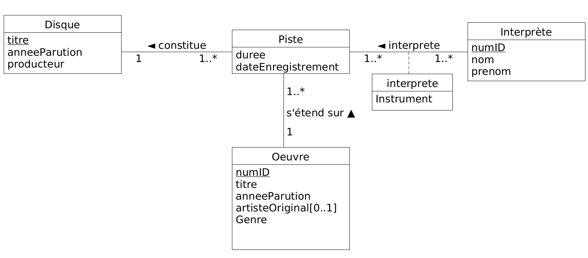
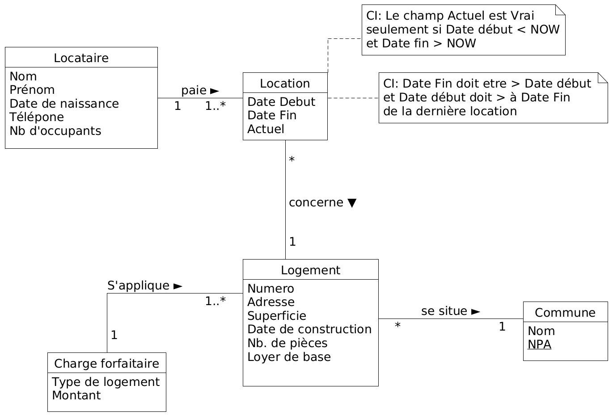
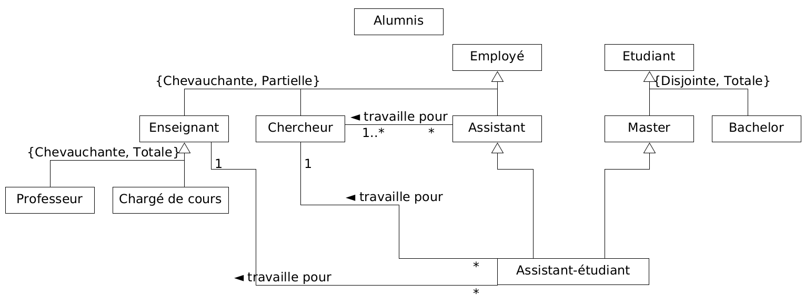
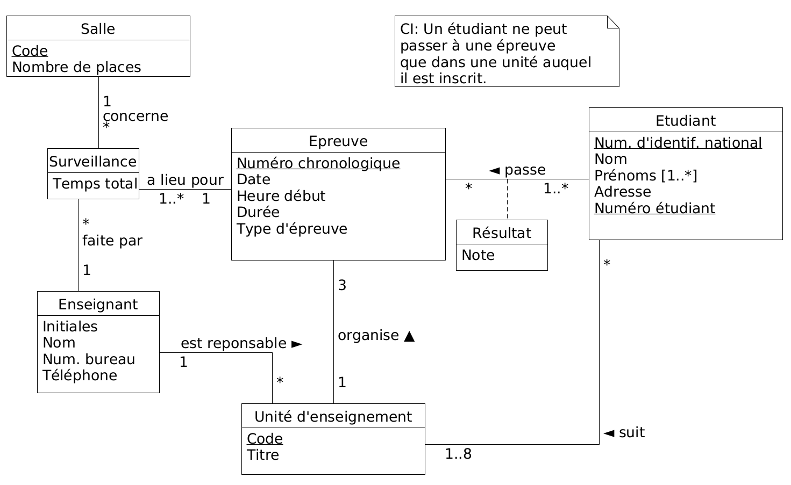

# Rapport labo 01 - BDR
Groupe: Samuel Roland, Arthur Junod et Edwin Haeffner.

## Exercice 2 - Modélisation d’une université

- a) **Les diagrammes B et D permettent d'avoir plusieurs consultations par cours.**
- b) **Les diagrammes A, B et C permettent d'avoir exactement un enseignant par consultation !** 
- c) **Les diagrammes A, C et D permettent d'avoir plusieurs consultations par enseignant**
- d) **Les diagrammes B et C permettent qu'un enseignant offre plusieurs périodes de consultation pour chacun de ses cours.**
- e) **Les 3 diagrammes nous semble être conformes à la spécification.**
- f) **Le diagramme A.**

## Exercice 3 - Modélisation d’une collection de disques

## Exercice 4 - Modélisation d’une agence de location

Pour savoir qui est le locataire actuel d'un logement, il suffit de récupérer la dernière et seule location où le champ Actuel est Vrai, et d'y prendre le locataire associé.

## Exercice 5 - Modélisation du personnel d’une université

## Exercice 6 - Modélisation des épreuves d’une université

- a) Où faut-il mémoriser la note de l’étudiant pour chaque épreuve ?  
**Dans une entité d'association entre Etudiant et Epreuve.**
- b) Est-ce qu’une association directe entre Etudiant et UE est nécessaire dans votre schéma ? Expliquez.  
**Comme au début du semestre les étudiants n'ont pas encore passé d'épreuves, il est nécessaire de les lier aux unités d'enseignement, elles ne peuvent pas être déduites.**
- c) Que faut-il faire si on veut mémoriser la moyenne de chaque étudiant par UE ?  
**Il faudrait faire une entité d'association entre Etudiant et Unité d'enseignement pour y stocker cette moyenne, qui peut être nulle au début du semestre.**
- d) Les épreuves sont surveillées par un ou plusieurs enseignants et peuvent se dérouler simultanément dans différentes salles. Les salles sont caractérisées par un code et un nombre de places. Un enseignant peut passer d’une salle à l’autre durant un contrôle. On désire connaître le temps de présence passé dans chaque salle au total. Compléter le schéma pour répondre à cette question.  
**Comme nous n'avons pas besoin de l'historique des présences et temps de présence des enseignants durant leurs surveillances d'épreuves, une association ternaire avec en attribut le temps total, suffit à stocker cette information. Les salles où se passent une épreuve spécifique peut ainsi être déduites.**
